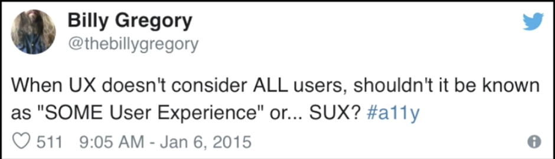
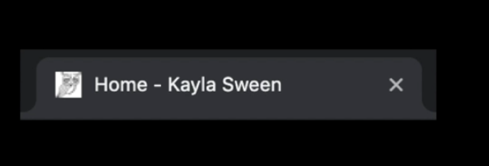
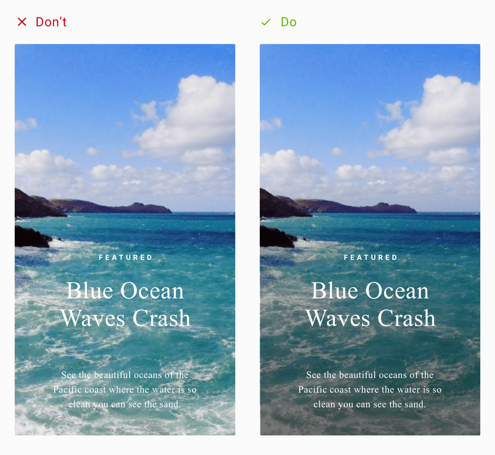
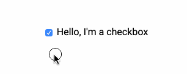

# Designing For Inclusive User-Experience

In this talk, [Kayla Sween](https://twitter.com/_kaylasween) shares how to avoid SUX ("Some User Experience").

Here's the [talk link](https://egghead.io/lessons/egghead-egghead-talks-designing-for-inclusive-user-experience) 📹

- [Designing For Inclusive User-Experience](#designing-for-inclusive-user-experience)
  - [What is "SUX" (Some User Experience)](#what-is-%22sux%22-some-user-experience)
  - [Important Terminologies](#important-terminologies)
    - [Web Content Accessibility Guidelines 2.1](#web-content-accessibility-guidelines-21)
    - [Assistive technologies](#assistive-technologies)
  - [How You Can Avoid "SUX" When Building Websites](#how-you-can-avoid-%22sux%22-when-building-websites)
    - [Use Clear Page Titles](#use-clear-page-titles)
    - [Have Sufficient Contrast Between Foreground & Background](#have-sufficient-contrast-between-foreground--background)
    - [Add Meaningful Content To Links](#add-meaningful-content-to-links)
    - [Associate Form Elements With Their Labels](#associate-form-elements-with-their-labels)
    - [Make Your Website Keyboard Accessible & Add Visual Focus](#make-your-website-keyboard-accessible--add-visual-focus)
    - [Setting Text Alternatives For Images](#setting-text-alternatives-for-images)

## What is "SUX" (Some User Experience)

Web accessibility is about designing and building for every kind of person. It isn't restricted only to the visually/hearing impaired or people with disabilities.

We want everyone to be able to navigate, use, and consume the contents of our website. So we need to make sure that we're developing with everybody in mind. Not just the common case.



## Important Terminologies

### Web Content Accessibility Guidelines 2.1

The Web Content Accessibility Guidelines 2.1 are a set of standards for designers and developers to follow so that they can design and build inclusive experiences.

### Assistive technologies

They are the set of hardware or software that help users to consume content. Some examples are:

- Screen readers
- Screen magnifiers
- Dictation Software

## How You Can Avoid "SUX" When Building Websites

### Use Clear Page Titles

In the `<head>` tag of your HTML, make sure that you add a title because this is the first thing that will be read by a screen reader.

Also, setting the title allows users to manage their tabs easily since they can understand what each tab is for and what website they're on.

```HTML
<head>
 <title>Home | My Website</title>
</head>

```



> If you're using React.js, [react-helmet](https://github.com/nfl/react-helmet) helps in managing the titles of your React App

### Have Sufficient Contrast Between Foreground & Background

Text over images looks nice; however, if we're not careful, we might have a low contrast between the foreground and the background image. This will make the text less visible and much harder to read.

A cool browser extension you can use to test whether or not you have sufficient contrast is [color contrast analyzer](https://chrome.google.com/webstore/detail/color-contrast-analyzer/dagdlcijhfbmgkjokkjicnnfimlebcll?hl=en)

The good news is you don't have to sacrifice aesthetics for accessibility.

Adding an overlay to the background image makes the foreground text a lot easier to read.

Here's an example:



On the other hand, if you're using solid colors as your background, you can test the contrast between the text color and the background color using tools like [Colorable](https://colorable.jxnblk.com/) or [WebAIM Color Contrast Checker](https://webaim.org/resources/contrastchecker/)

### Add Meaningful Content To Links

To further enhance the inclusiveness of your website, you should add meaningful content to your links. Some users set the screen readers only to read headings and links when they visit a page.

Using "click here" is not considered descriptive, and is ineffective for a screen reader user. So now, they will have to adjust their screen reader settings to read the entire content to understand the context.

Non-screen reader users share a similar experience, because "click here" links are not easily scannable.

Here are two examples of important links:

"For a complete list of all available HTML tags, visit our **HTML Tag Reference**" (source: [w3schools](https://23schools.com/) )

"The IRS recommends using its online **Where's My Refund Tool** or the mobile app, **IRS2Go**. These systems are updated once every 24 hours and are the fastest ways to track your refund." (source: [USA Gov](https://www.usa.gov/after-taxes) )

Having meaningful names for links is also useful for SEO (Search Engine Optimization) and will make your webpage rank higher in search engines.

### Associate Form Elements With Their Labels

Associating form elements with their labels increases the clickable area. This is crucial for mobile users since they use smaller screens.

```HTML
<label for="name">Name:</label>
<input type="text" id="name"/>
```

Here's an example of an accessible checkbox. Much easier to use on mobile because users can click the label to check the box.


All you need to do to achieve this is to use the `for` attribute on your label and match it to the id on your input.
To test that everything works correctly, clicking on the label will bring focus (a border will surround the element) to the input.

### Make Your Website Keyboard Accessible & Add Visual Focus

Some users only use a keyboard to navigate a website by using the `Tab` key. These users might have dexterity issues, or they might be using a screen reader.

You need to make sure that every element a user can interact with can receive visual focus, an indicator that this element is clickable.

### Setting Text Alternatives For Images

the `` tag in HTML has an `"alt"` attribute that will render a description of the image in case the image doesn't load.
However, this attribute is important for screen reader users because it helps them determine what the images are and what their context is.

When setting the "alt" attribute, make sure you give it a value that is relevant to the context that it's in.

Here's an example of an image with good alt text:


```HTML

```

The exception to this is when you have a purely decorative image, like a line separator or an image that you're using as a bullet inside a list. Then you can use an empty `alt` attribute.

Some cool tools you can use to check the accessibility of your site automatically:

- [Siteimprove Accessibility Checker](https://chrome.google.com/webstore/detail/siteimprove-accessibility/efcfolpjihicnikpmhnmphjhhpiclljc)
- [WAVE - Web Accessibility Evaluation tool](https://wave.webaim.org/)
- [AXE](https://chrome.google.com/webstore/detail/axe-web-accessibility-tes/lhdoppojpmngadmnindnejefpokejbdd)

While these tools are awesome, the best way to test if your website is accessible is to use it the same way a user will.

Use the `Tab` key to navigate the entire website; make sure that everything is readable, and that everything works.

For screen readers, you can use:

- [NVDA ( Windows)](https://www.nvaccess.org/about-nvda/)
- [JAWS (Windows)](https://www.freedomscientific.com/products/software/jaws/)
- [VoiceOver (macOS/iOS)](https://www.apple.com/voiceover/info/guide/_1124.html)
- [TalkBack (Android)](https://support.google.com/accessibility/android/answer/6283677?hl=en)

And to check the color contrast you can use:

- [Dalton](https://chrome.google.com/webstore/detail/colorblind-dalton-for-goo/afcafnelafcgjinkaeohkalmfececool?hl=en) simulates four types of color blindness.
- [Color contrast Analyzer](https://chrome.google.com/webstore/detail/color-contrast-analyzer/dagdlcijhfbmgkjokkjicnnfimlebcll?hl=en), checks that your website has sufficient contrast.
